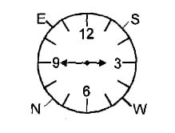

# Day 11 : Tasks

## Reasoning

The time on the watch is a quarter to three. If the minute hand points to North-East, in which direction does the hour hand point?

1. South-West
2. South-East
3. North-West
4. North-East


**Ans:** South-West




## Technical MCQ

What is the worst-case complexity of deletion in a B-Tree?

1. O\(logn\)
2. O\(logn\)^2
3. O\(log\(logn\)\)
4. n^2


**Ans:** O\(logn\)


## Coding Question

`Asked in Amazon`

You are the head of the Amazon Parcel Store where at most K parcel can be kept. If \(K+1\)th parcel comes to the store then you will remove the first parcel that came earlier to the store. There is priority A\[i\] that is associated with all the parcel you have to tell what is the maximum priority parcel that is present in the parcel store at every time on new parcel arrival \( after having K - 1 parcel \) in the store.

Note: We have to tell the maximum priority of the parcel after storing the new parcel in the store.

`Input:`

```text
5 2 
10 5 1 2 7
```

`Output:`

```text
10 5 2 7
```

 

**`Explanation :`** `1st parcel arrival: When parcel 1st come to store its not Kth parcel so print nothing. 2nd parcel arrival: When parcel 2nd come to store it is Kth parcel so we will print maximum priority of parce till now i.e 10. 3rd parcel arrival: Now store have [5 , 1] parcels so maximum pariority among them is 5. and so on...`

```cpp
void parcel_store(int *arr, int n, int k)
{
   deque<int>q;
   for(int i=0;i<k;i++)
   {
    while(q.size()!=0 && arr[q.back()]<=arr[i])
    q.pop_back();
    q.push_back(i);
   }
   cout<<arr[q.front()]<<" ";
   for(int i=k;i<n;i++)
   {
    while(!q.empty() && i-q.front()>=k)
    q.pop_front();
    while(q.size()!=0 && arr[q.back()]<arr[i])
    q.pop_back();
   q.push_back(i);
   cout<<arr[q.front()]<<" ";
   }
   
}
```

