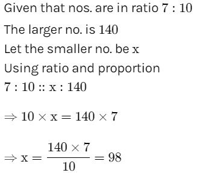
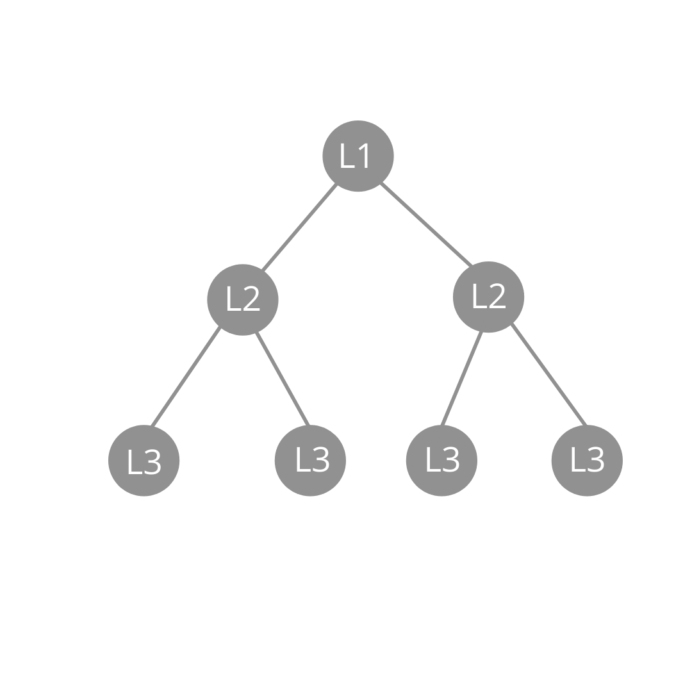

# Day 18 : Tasks

## Aptitude

Two numbers are in the ratio 7:10. If the larger number is 140, what is the smaller number? 

* 94
* 96
* 98
* 92


**Ans:** 98




## Technical MCQ

A process executes the code

```cpp
fork ();
fork (); 
fork ();
```

 The total number of child processes created is 

* 3
* 4
* 7
* 8


**Ans** \(C\) 7

Let us put some label names for the three lines

fork \(\); // Line 1 

fork \(\); // Line 2 

fork \(\); // Line 3




`We can also use a direct formula to get the number of child processes. With n fork statements, there are always 2^n – 1 child processes.`


## Coding

There is a computer network connected in a Binary tree-like structure. You as a network engineer want to connect any of the leaf computers with all other leaf computers with wlan wires. It is not possible to connect two leaf computer if the difference between their depth from the root is greater than 1. You need to tell your Boss whether it is possible to connect any of the leaf computers with all other leaf computers.

**Note that, if the network contains only one leaf computer then you don't need to connect it. That is, the output will be "YES"**

Input: The First line of input contains the number of test cases T. For each test case, there will be only a single line of input which is a string representing the network as described below:

The values in the string are in the order of level order traversal of the network where, numbers denote computers, and a character “N” denotes NULL child.

**Example:** 

```cpp
Input: 
2 
1 2 3 4 5 6 7 
1 2 3 4 5 N N 6 

Output: 
Yes 
No
```


**Explanation**: 

```cpp
Test Case 1:

                         1
                       /   \
                      2     3
                     / \   / \
                    4   5 6   7

All leaf computers are at same level.


Test Case 2:

                         1
                       /   \
                      2     3
                     / \   
                    4   5
                    
Leaf computers are 3, 5 & 6 and 
their depths are 2, 3 and 4 respectively and (4-2)=2 > 1

```

### Solution :

```cpp
vector<int>v;
void find(Node* root,int depth)
{
    if(!root) return;
    if(!root->left && !root->right)
    {v.push_back(depth);
    return;
    }
    find(root->left,depth+1);
    find(root->right,depth+1);
}
bool isPossible(Node *root) {

    v.clear();
    find(root,0);
    sort(v.begin(),v.end());
     
if(abs(v[0]-v[v.size()-1])>1) return false;
    return true;
}
```


