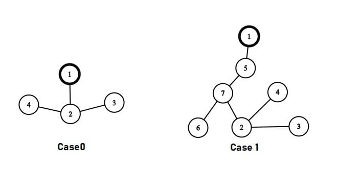

# Day 2 : Tasks

## Aptitude 

It costs Rs. 1 to photocopy a sheet of paper. However,  2% discount is allowed on all photocopies done after the first 1000 sheets. How much will it cost to copy 5000 sheets of paper? 

* Rs. 3920
* Rs. 3980
* Rs. 4900
* Rs. 4920


**Ans:** Rs. 4920

Total cost : 

= Rs. \[1 × 1000 + \(100 - 2\)% of 1 × 4000\] 

= Rs. \(1000 + 0.98 × 4000\) = Rs. \(1000 + 3920\) = Rs. 4920


## Technical

 A normal queue if implemented using an array of size MAX\_SIZE gets full when, 

* Front = Rear + 1
* Rear = MAX\_SIZE-1
* Rear = Front
* Front = \(Rear+1\)mod MAX\_SIZE


**Ans :** Rear = MAX\_SIZE - 1


## Coding Question

There is a country having a tree structure, having p cities connected by p-1 undirected highways. The capital of the country is city 1.There are some people living in this country, each city has pi people with a home in that city. There is voting going on in the country and each citizen has to visit capital for voting and they come back to their home via the shortest path possible.

The Government came to know that there are some inequalities among the current population. They plan to bring new people from other countries in some cities. They define e-score of the city as number of people visiting that city when going back to their home, including ones living there. Governement plans to do operations to make e-score of each city unique.

The operation is defined as: • Select two cities a and b with e-scores a1 and b1, and make e-score of a as a1+b1. This doesn't affect the e-score of city b.

Find the minimum number of such operation needed to be performed to make the e-score of all cities unique. Note: This operation is performed when everyone reaches back to their home after voting.

**`Constraints:`**

 `1 <= p <= 2*10^5` 

`0 <= pi <= 10^9` 

`1 <= ui,vi <= p`

**`Input Format:`** The first line contains an integer p, the number of cities. Next p lines containing p integers, where pi is the number of citizens living in city i. Next p-1 lines contain a description of the highways, where each line has two integers ui and vi, which denotes cities u and v are connected via ith road.

**`Output Format:`** A Single integer denoting the minimum operations required to make e-scores of all city unique or "-1" if it is not possible to do so.

**`Sample Input:`**

```text
4 
1 
1 
2 
2 
1 2 
2 3 
2 4
```

 **`Sample Output:`** 

```text
1
```

**Explanation** : In the first case, there are 4 cities and structure of thecountry is given. All citizens are at Capital\(City 1\), and visit their place by shortest path. So citizens of city 1 follow - \[1\], City 2 - \[1-2\], City 3 - \[1-2-3\], City 4 - \[1-2-4\]. So the e-score array we get: \[6,5,2,2\]. Now to make e-score unique we modify e-score of city 3 from 2 to 2+2=4. So we require 1 operation.



### Solution:


This problem can be solved using DFS for inital part. We have to know the e-score of all cities first and it is equal to number of people visiting each city while travelling back from the capital. So we can create a graph\(tree here\) and do a depth first search from capital keeping in mind the people from each city. This will help us to calculate the e-score of each city for all cities in single traversal. We will keep the track of citizens coming in dfs path from leaf and use it with number of citizens from a city and summing up the two will give us the number of citizens visiting each city. This will be doing recursively during dfs. Once we have the escore array, we need to make it unique. So we need to find the number of unique elements. As making any element unique would take at max 1 operation and if we have multiple 0's then two operations. So, the difference of total elements and unique elements along with consideration of 0's. 

**Note:** If we have only 0's then, then answer would be -1.


```cpp
#include<bits/stdc++.h>
using namespace std;
vector<vector<int>> g;
vector<int> vis;
vector<long long> viscount;
vector<int> citizens;


long long dfs(int i){
    vis[i]=true;
    long long to=0;
    for(int j=0;j<g[i].size();j++){
        if(!vis[g[i][j]]){
            to += dfs(g[i][j]);
        }
    }
    viscount[i] = citizens[i] + to;
    return viscount[i];
}

int main(){
	int p;
	cin >> p;
	citizens.assign(p,0);	
	for(int i=0;i<p;i++){
		cin >> citizens[i];
	}
	int u,v;
	g.assign(p,vector<int>());
	vis.assign(p,false);
	viscount.assign(p,0);
	for(int i=0;i<p-1;i++){
		cin >> u >> v;
		g[u-1].push_back(v-1);
		g[v-1].push_back(u-1);
	}
	viscount[0]=dfs(0);
	

	set<long long> s;
	int cz=0;
	for(int i=0;i<viscount.size();i++){
		s.insert(viscount[i]);
		cout << viscount[i] << endl;
		if(viscount[i]==0)
			cz++;
	}
	if(s.size()==1&&cz>0){
		cout << "-1" << endl;
	}
	else{
		long long res;
		if(cz>0)
			res = p-(s.size())+(cz-1);
		else
			res = p-(s.size());
		cout << res << endl;		
	}
}
```

