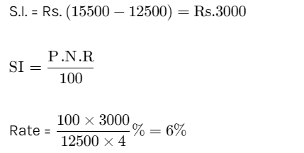

# Day 21 : Tasks

## Aptitude

A sum of Rs. 12,500 amounts to Rs. 15,500 in 4 years at the rate of simple interest. What is the rate of interest? 

* 3
* 4
* 5
* 6


**Ans:** 6




## Technical MCQ

Virtual keyword is used?

* to remove static linkages
* to call function based on kind of object it is being called for
* to call the methods that don't exist at compile time
* all the above


**Ans:** All the above

Explanation: All the options are correct as virtual is the keyword used with function of base class then all the functions with the same name in a derived class, having different implementations are called instead of the base class function being called each time.

The Compiler creates vtables for each class with virtual function so whenever an object for the virtual classes is created compiler inserts a pointer pointing to vtable for that object. Hence when the function is called the compiler knows which function is to be called actually.

**Example:**

class geom {

public:

virtual void show\( \) { cout &lt;&lt; ” the area is: x” &lt;&lt; endl; } };

class rect: public geom { 

void show\( \){ 

cout &lt;&lt; ”the area is: y” &lt;&lt; endl;

 } };

 int main\( \) { 

geom\* a; rect b; a= &b; a - &gt; show\( \); }

**Output**: the area is: y


## Coding

There is a Giant who is exhausted. To gain the strength he will go through a N\*M integer grid Arr\[N\]\[M\] which contains food packets. Arr\[i\]\[j\] is the amount of strength he gains after eating the food packet. Strength gained by eating a food packet can also be negative\( i.e. Arr\[i\]\[j\]&lt;0\). From row r and column c, he can go to any of the following three indices:

I. Arr\[ r+1 \]\[ c-1 \] \(valid only if c-1&gt;=0\) 

II. Arr\[ r+1 \]\[ c \] 

III. Arr\[ r+1 \]\[ c+1 \] \(valid only if c+1&lt;=N-1\)

So if he starts at any column on row 0, what is the maximum strength he can earn till row N-1. If the strength earned is negative print 0, because in that case, he will not enter the grid.

Note: If Giant is standing at Arr\[i\]\[j\] he has to eat that food packet.

**Example:**

```cpp
Input:
 2 
 2 2 
 10 4 
 3 5 
 2 2 
 5 -1 
 -2 -1 
 
 Output: 
 15 
 4
```

 

**Explanation:** 

**`Testcase 1:`** `He will eat 10 in 1st row and 5 in second row. Testcase 2: He will eat 5 in 1st row and -1 in second row.`

### Solution :

```cpp
int strength(vector<vector<int>> &grid, int n, int m)
{
    for(int i=1;i<n;i++)
    {
        for(int j=0;j<m;j++)
        {
            int a=grid[i-1][j];
            
            if(j-1>=0)
            a=max(a,grid[i-1][j-1]);
            if(j+1<m)
            a=max(a,grid[i-1][j+1]);
            grid[i][j]+=a;
        }
    }
    int p= *max_element(grid[n-1].begin(),grid[n-1].end());
    if(p<0) return 0;
    return p;
}
```

