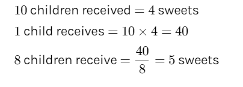

# Day 22 : Tasks

## Aptitude

A packet of sweets was distributed among 10 children and each of them received 4 sweets. If it is distributed among 8 children, how many sweets will each child get? 

* 4
* 5
* 6
* 7


**Ans:** 5




## Technical MCQ

Which of the following statement is true? 

* DELETE does not free the space containing the table and TRUNCATE free the space containing the table
* Both DELETE and TRUNCATE free the space containing the table
* Both DELETE and TRUNCATE does not free the space containing the table
* DELETE free the space containing the table and TRUNCATE does not free the space containing the table


**Ans:** DELETE does not free the space containing the table and TRUNCATE free the space containing the table

**Explanation:** The SQL TRUNCATE command is used to delete all the rows from the table and free the space containing the table.


## Coding

Write a function to find the longest common prefix string amongst an array of strings.

If there is no common prefix, return an empty string "".

**Example 1:**

```cpp
Input: 
strs = ["flower","flow","flight"]

Output: 
"fl"
```

**Example 2:**

```cpp
Input: 
strs = ["dog","racecar","car"]

Output: 
"" 
//Explanation: There is no common prefix among the input strings.
```

### Solution:

```cpp
struct Trie{
        unordered_map<char,Trie*> child;
        bool isword=false;
    }root;
    void insert(string word){
        auto cur=&root;
        for(char c : word){
            if(cur->child.find(c)==cur->child.end())
                cur->child[c]=new Trie();
            cur=cur->child[c];
        }
        cur->isword=true;
    }
    string longestCommonPrefix(vector<string>& strs) {
        if(strs.size()==0) return "";
        for(auto word:strs)
            insert(word);
        auto cur=&root;
        string res="";
        while(cur&&!cur->isword&&(cur->child.size()==1)){
            auto it=cur->child.begin();
            res+=it->first;
            cur=it->second;
        }
        return res;
    }
```

