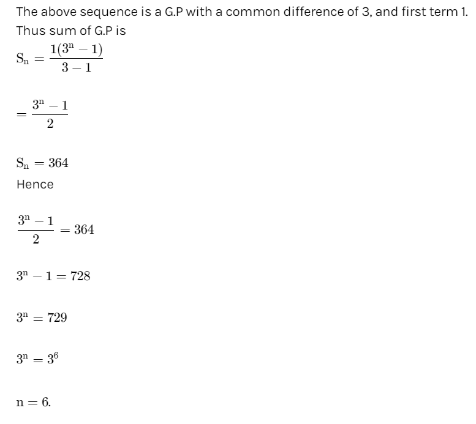

# Day 24: Tasks

## Aptitude

How many terms of the series 1+3+9+ ...sum to 364 ? 

* 5
* 6
* 3
* 4


 **Ans :** 6




## Technical MCQ

Which of the following is correct for copy constructor? 

* The argument object is passed by reference
* It can be defined with zero arguments
* Used when an object is passed by value to a function
* Used when a function returns an object


**Ans:** It can be defined with zero arguments


## Coding

Say you have an array prices for which the ith element is the price of a given stock on day i.

Design an algorithm to find the maximum profit. You may complete as many transactions as you like \(i.e., buy one and sell one share of the stock multiple times\).

**`Note:`** `You may not engage in multiple transactions at the same time (i.e., you must sell the stock before you buy again).`

**Example 1:**



```cpp
Input: 
[7,1,5,3,6,4] 

Output: 
7 

```



```
Buy on day 2 (price = 1) and sell on day 3 (price = 5), 
profit = 5-1 = 4. 
Then buy on day 4 (price = 3) and sell on day 5 (price = 6), profit = 6-3 = 3.
```



 **Example 2:**



```cpp
Input:
[1,2,3,4,5] 

Output: 
4
```



```
Buy on day 1 (price = 1) and sell on day 5 (price = 5), 
profit = 5-1 = 4. Note that you cannot buy on day 1, 
buy on day 2 and sell them later, as you are engaging multiple 
transactions at the same time. You must sell before buying again.
```



 **Example 3:**



```cpp
Input: 
[7,6,4,3,1] 

Output:
0 
```



```
In this case, no transaction is done, i.e. max profit = 0.
```



### **Solution:**

```cpp
int maxProfit(vector<int>& prices) {
        int mx=0;
        if(prices.size()==0) return mx;
        for(int i=0;i<prices.size()-1;i++)
        {   
            mx+=max(0,prices[i+1]-prices[i]);  
        }
        return mx;
    }
```

