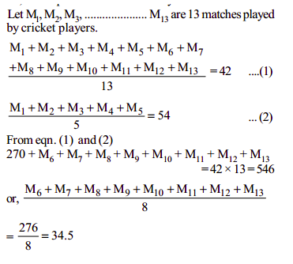

# Day 31: Tasks

## Aptitude

The average score of a cricketer for 13 matches is 42 runs. if his average score for the first 5 matches is 42. Then what is his average score\(in runs\) for the last 8 matches?

* 36.5
* 34.5
* 37.5
* 33.5


**Ans:** 34.5




## Technical MCQ

What is the output of the following program?

```cpp
#include<iostream>
#include<string.h>

using namespace std;
main() { 
   char s[] = "Hello\0Hi";
   
   cout<<strlen(s)<<" "<<sizeof(s);
}
```

* 5  9
* 7  20
* 5  20
* 8  20


**Ans:** 5 9

**`Explanation:`**`The length of the string is the count of character upto ‘\0’. sizeof – reports the size of the array.`


## Coding

A gene string can be represented by an 8-character long string, with choices from "A", "C", "G", "T".

Suppose we need to investigate about a mutation \(A mutation from "start" to "end"\), where ONE mutation is defined as ONE single character changed in the gene string.

**For example,** 

`"AACCGGTT" -> "AACCGGTA" is 1 mutation`.

Also, there is a given gene "bank", which records all the valid gene mutations. A gene must be in the bank to make it a valid gene string.

Now, given 3 things - start, end, bank, your task is to determine what is the minimum number of mutations needed to mutate from "start" to "end". If there is no such a mutation, return -1.

**Note:**

`The starting point is assumed to be valid, so it might not be included in the bank.`

`If multiple mutations are needed, all mutations in the sequence must be valid.`

`You may assume the start and end string is not the same.`

**Example 1:**

```cpp
start: "AACCGGTT" end: "AACCGGTA" bank: ["AACCGGTA"]
return: 1
```

**Example 2:**

```cpp
start: "AACCGGTT" end: "AAACGGTA" bank: ["AACCGGTA", "AACCGCTA", "AAACGGTA"] 
return: 2
```

**Example 3:**

```cpp
start: "AAAAACCC" end: "AACCCCCC" bank: ["AAAACCCC", "AAACCCCC", "AACCCCCC"]
return: 3
```

### Solution:

```cpp
int p=INT_MAX;
unordered_map<string,int>m,v;
void cal(string s,string &e,int k)
{
    if(s==e)
        {p=min(k,p);
        return ;
        }
    for(int j=0;j<s.size();j++)
       { for(auto c : {'A','C','G','T'})
            {string u=s;
            u[j]=c;
            if(m.count(u)==0 && v.count(u))
            {m[u]++;
             cout<<u<<" "<<k+1<<"\n";
            cal(u,e,k+1);
            }
            }
       }

}

    int minMutation(string s, string e, vector<string>& b) {
         for(int i=0;i<b.size();i++)
    v[b[i]]++;
        m[s]++;
     cal(s,e,0);   
     if(p==INT_MAX)
     return -1; 
    return p;
    }
```

