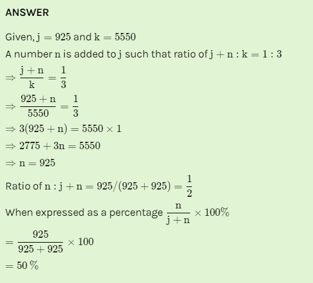

# Day 10 : Tasks

## Aptitude

j is equal to 925 and k is equal to 5,550. A number, n, is added to j, such that the ratio of j+n to k is 1:3. What is the ratio of n to j+n, expressed as a percentage of j+n ?

1. 30%
2. 40%
3. 50%
4. 60%


Ans : 50 %




## Technical

Which of the following is correct about this pointer in C++?   
  
a\) this pointer is passed as a hidden argument in all the functions of a class  
b\) this pointer is passed as a hidden argument in all non-static functions of a class   
c\) this pointer is passed as a hidden argument in all static functions of a class   
d\) this pointer is passed as a hidden argument in all static variables of a class


Ans : b  
  
Explanation: As static functions are a type of global function for a class so all the object shares the common instance of that static function whereas all the objects have there own instance for non-static functions and hence they are passed as a hidden argument in all the non-static members but not in static members.


## Coding Question

Given an array of integers A, find the sum of min\(B\), where B ranges over every \(contiguous\) subarray of A.

Since the answer may be large, return the answer modulo 10^9 + 7.

```text
Example 1:
Input: [3,1,2,4] 
Output: 17 
Explanation: Subarrays are [3], [1], [2], [4], [3,1], [1,2], 
[2,4], [3,1,2], [1,2,4], [3,1,2,4]. 
Minimums are 3, 1, 2, 4, 1, 1, 2, 1, 1, 1. 

Sum is 17.
```

## Solution :

```cpp
int sumSubarrayMins(vector<int>& a) {
        if (a.size() == 0)  return 0;
        int mod = pow(10, 9) + 7;
        stack<pair <int, int>> s1,s2;
        int left[a.size()],right[a.size()];
        for(int i=0;i<a.size();i++){
            int count=1;
            while(!s1.empty()&& s1.top().first>a[i]){
                count+=s1.top().second;
                s1.pop();
            }
            s1.push(make_pair(a[i],count));
            left[i]=count;
        }
        for(int i=a.size()-1;i>=0;i--){
            int count=1;
            while(!s2.empty()&& s2.top().first>=a[i]){
                count+=s2.top().second;
                s2.pop();
            }
            s2.push(make_pair(a[i],count));
            right[i]=count;
        }
        int ans=0;
        for(int i=0;i<a.size();i++){
            ans+=((left[i]*right[i]*a[i])%mod);
            ans%=mod;
        }
        return ans;
    }
```

