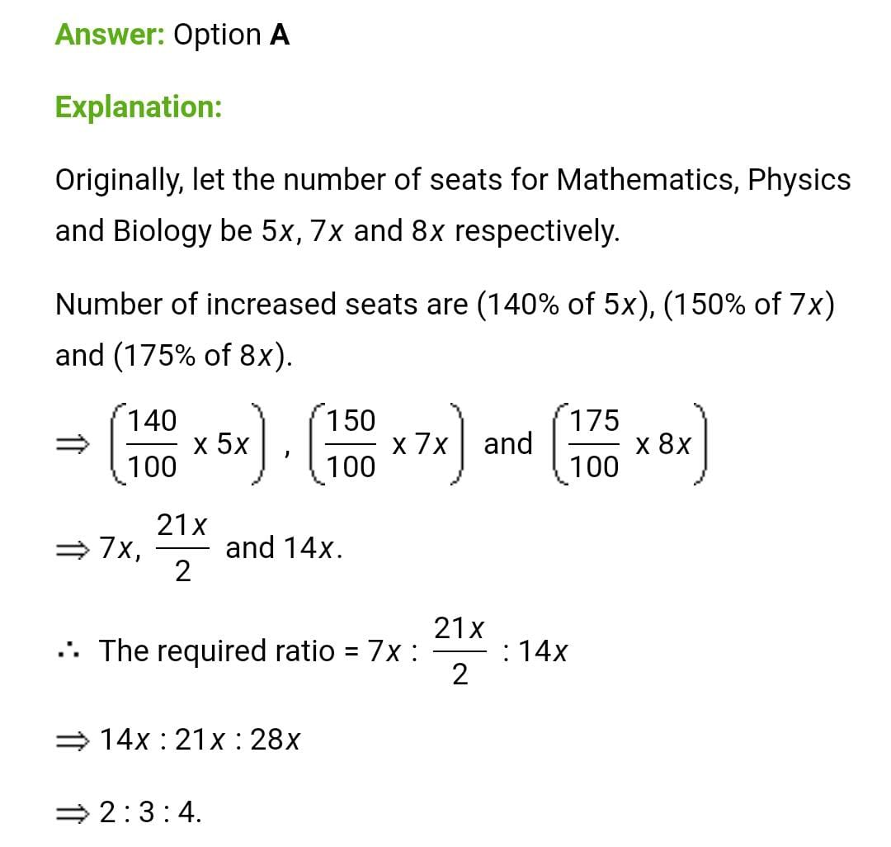

# Day 2 : Tasks

## Aptitude

Seats for Mathematics, Physics and Biology in a school are in the ratio 5 : 7 : 8. There is a proposal to increase these seats by 40%, 50% and 75% respectively. What will be the ratio of increased seats?

1. 2 : 3 : 4 
2. 6 : 7 : 8 
3. 6 : 8 : 9 
4. none of these


**Answer: 2 : 3 : 4**




## Technical

Which of the following statements are incorrect?

1. static methods can call other static methods only
2. static methods must only access static data
3. static methods can not refer to this or super in any way
4. when object of class is declared, each object contains its own copy of static variables.


**Answer:** when object of class is declared, each object contains its own copy of static variables.

Explanation: All objects of class share same static variable, when object of a class are declared, all the objects share same copy of static members, no copy of static variables are made.


## Coding Question

Given a string and a list of words, find all the starting indices of substrings in the given string that are a concatenation of all the given words exactly once without any overlapping of words. It is given that all words are of the same length.

```text
Example:

Input: string="bathitbat" words+=["bat", "hit"]
Output: [0,3]
Explanation: The 2 substrings containing both the words are "bathit" and "hitbat".
```

## Solution

```cpp
vector<int> findindices(string s, vector<string> words)
{
      unordered_map<string,int> wordmap;
      for(auto word: words)
      {
          wordmap[word]++;
      }

      vector<int> result;
      int wordscount=words.size(), wordlength= words[0].length();

     for(int i=0;i<=s.length()-wordscount*wordlength;i++)
     {
         unordered_map<string,int> seenwords;

         for(int j=0;j<wordscount;j++)
         {
              int index_of_nextword=i+j*wordlength;

              string word=s.substr(index_of_nextword,wordlength);

              if(wordmap.find(word)==wordmap.end()) // break if this word is not required
              break; 

              seenwords[word]++;  // insert word to seen words map

              if(seenwords[word]>wordmap[word]) //break if frequency is higher than required
              break;

              if(j+1==wordscount)
              result.push_back(i);
         }
     }
     return result;
}
```

