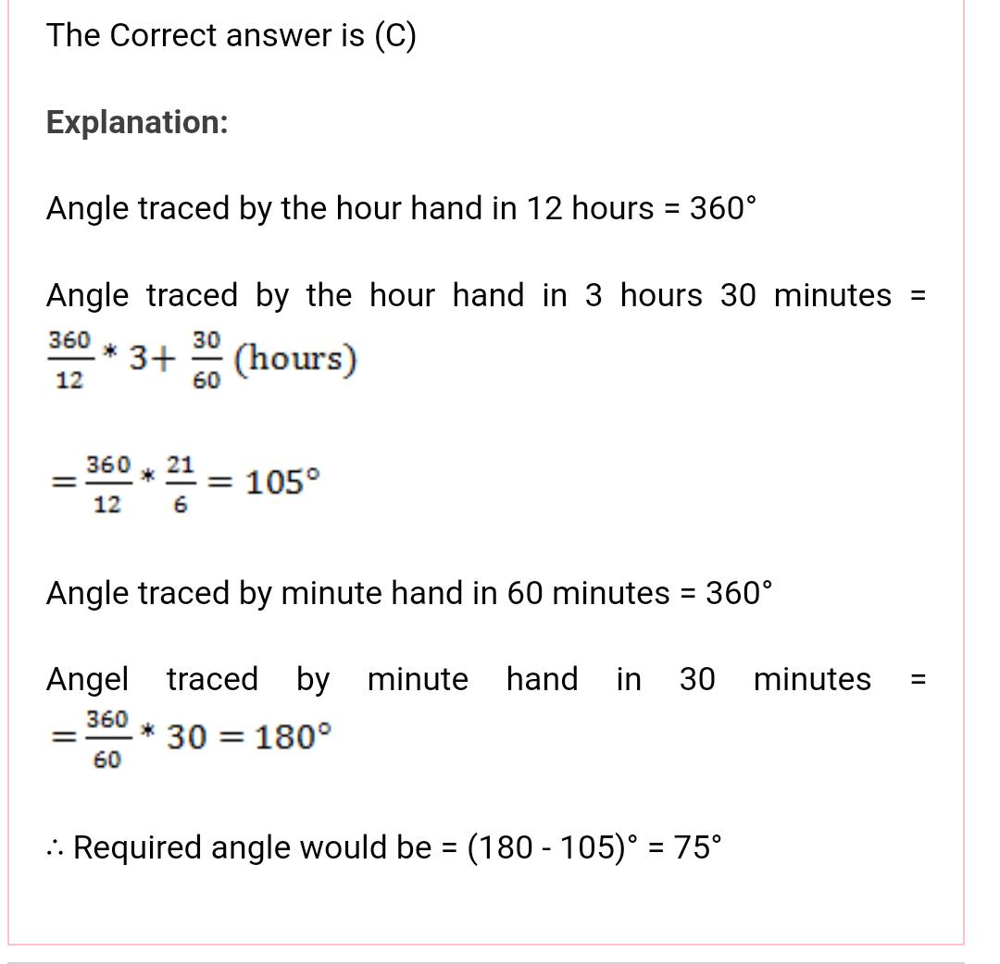

# Day 5 : Tasks

## Aptitude

What is the angle between hour hand and minute hand of a clock at 3.30?

1. 65° 
2. 70°
3. 75°
4. 80°


**Answer:** 75°




## Technical

Which of the following is the correct syntax to send an array as a parameter to function?

1. func\(&array\); 
2. func\(\#array\);
3. func\(\*array\);
4. func\(array\[size\]\);


**Answer:** func\(&array\); 


## Coding Question

There are n cities. Some of them are connected, while some are not. If city a is connected directly with city b, and city b is connected directly with city c, then city a is connected indirectly with city c.

A province is a group of directly or indirectly connected cities and no other cities outside of the group.

You are given an n x n matrix isConnected where isConnected\[i\]\[j\] = 1 if the ith city and the jth city are directly connected, and isConnected\[i\]\[j\] = 0 otherwise.

Return the total number of provinces.

```text
Example 1:


Input: isConnected = [[1,1,0],[1,1,0],[0,0,1]]
Output: 2
Example 2:


Input: isConnected = [[1,0,0],[0,1,0],[0,0,1]]
Output: 3
```

## Solution:

```cpp
int findParent(vector<int>& parent, int city){
        if (parent[city] == city){
            // This is the root node (it's its own parent)
            return city;
        }
        return findParent(parent, parent[city]);
    } 
    
    int findCircleNum(vector<vector<int>>& isConnected) {
        /*
        union find 
        */
        int n = isConnected.size();
        vector<int> parent(n);
        // to start, make each city a root node 
        for (int i = 0; i < n; i++){
            parent[i] = i;
        }
        
        // the # of provinces are = # of roots
        int numProvinces = n;
        for (int i = 0; i < n; i++){
            // the adjacency list n x n, but we only need to 
            // see half of it, since it's symetrical along the 
            // diagonal: hence: j = i + 1
            for (int j = i + 1; j < n; j++){
                if (isConnected[i][j]){
                    // they are connected, so they're 
                    // roots should be the same
                    int parentOfI = findParent(parent, i);
                    int parentOfJ = findParent(parent, j);
                    if (parentOfI != parentOfJ){
                        // there should be one less root
                        parent[parentOfI] = parentOfJ;
                        numProvinces--;
                    }
                }
            }
        }
                
        return numProvinces;
    }
```

