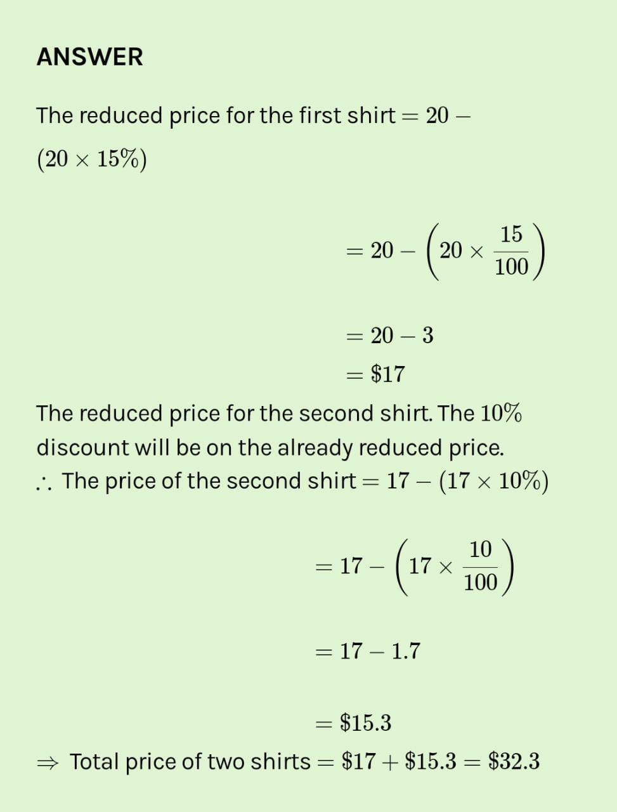

# Day 8 : Tasks

## Aptitude

## A shop is offering discounts on shirts costing $20 each. If someone buys 2 shirts, he will be offered a discount of 15% on the first shirt and another 10% discount on the reduced price for the second shirt. How much would one pay for two shirts at this shop?

1. 30.3
2. 31.6
3. 32.3
4. 33.3


**Answer: 32.3**




## Technical

Which of the join operations do not preserve non matched tuples? 

1. Left outer join
2. Right outer join
3. Inner join 
4. Natural join


**Answer:** Inner Join

Explanation: INNER JOIN: Returns all rows when there is at least one match in BOTH tables.


## Coding Question

There are N rooms and you start in room 0. Each room has a distinct number in 0, 1, 2, ..., N-1, and each room may have some keys to access the next room. Formally, each room i has a list of keys rooms\[i\], and each key rooms\[i\]\[j\] is an integer in \[0, 1, ..., N-1\] where N = rooms.length. A key rooms\[i\]\[j\] = v opens the room with number v. Initially, all the rooms start locked \(except for room 0\). You can walk back and forth between rooms freely. Return true if and only if you can enter every room.

```text
Example 1:

Input: [[1],[2],[3],[]] 
Output: true
 Explanation: We start in room 0, and pick up key 1. We then go to room 1, and pick up key 2. We then go to room 2, and pick up key 3. We then go to room 3. Since we were able to go to every room, we return true. 

Example 2:

Input: [[1,3],[3,0,1],[2],[0]] 
Output: false
 Explanation: We can't enter the room with number 2. 
```

_Note:_

_1 &lt;= rooms.length &lt;= 1000_

_0 &lt;= rooms\[i\].length &lt;= 1000_

_The number of keys in all rooms combined is at most 3000._

## Solution:

```cpp
bool canVisitAllRooms(vector<vector<int>>& room) {
      vector<int>v(room.size(),0);
        queue<int>q;
        q.push(0);
        while(!q.empty())
        {
            int r=q.front();
                q.pop();
            if(!v[r])
            {
                v[r]=1;
                for(int i=0;i<room[r].size();i++)
                    q.push(room[r][i]);
            }
        }
        for(int i=0;i<room.size();i++)
            if(!v[i])
                return false;
        return true;
}
```

