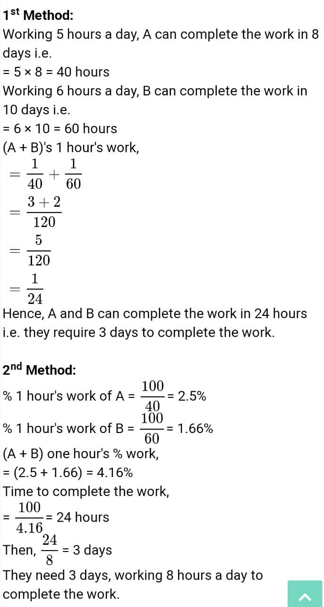

# Day 9 : Tasks

## Aptitude

## Working 5 hours a day, A can Complete a work in 8 days and working 6 hours a day, B can complete the same work in 10 days. Working 8 hours a day, they can jointly complete the work in:

1. 3 days
2. 4 days
3. 4.5 days
4. 5.4 days


**Answer:**3 days




## Technical

Why Java is Partially OOP language?

1. It supports usual declaration of primitive data types
2.  It doesn’t support all types of inheritance
3.  It allows code to be written outside classes 
4.  It does not support pointers


**Answer:** It supports usual declaration of primitive data types

Explanation: As Java supports usual declaration of data variables, it is partial implementation of OOP. Because according to rules of OOP, object constructors must be used, even for declaration of variables.


## Coding Question

You may recall that an array arr is a mountain array if and only if: arr.length &gt;= 3 .There exists some index i \(0-indexed\) with 0 &lt; i &lt; arr.length - 1 such that:

arr\[0\] &lt; arr\[1\] &lt; ... &lt; arr\[i - 1\] &lt; arr\[i\]

arr\[i\] &gt; arr\[i + 1\] &gt; ... &gt; arr\[arr.length - 1\]

Given an integer array arr, return the length of the longest subarray, which is a mountain. Return 0 if there is no mountain subarray.

```text
Example 1:

Input: arr = [2,1,4,7,3,2,5] 
Output: 5 
Explanation: The largest mountain is [1,4,7,3,2] which has length 5. 

Example 2:

Input: arr = [2,2,2] 
Output: 0
 Explanation: There is no mountain.
```

_Intuition: We have already many 2-pass or 3-pass problems, like 821. Shortest Distance to a Character. They have almost the same idea. One forward pass and one backward pass. Maybe another pass to get the final result, or you can merge it in one previous pass._

Explanation: In this problem, we take one forward pass to count up hill length \(to every point\). We take another backward pass to count down hill length \(from every point\). Finally a pass to find max\(up\[i\] + down\[i\] + 1\) where up\[i\] and down\[i\] should be positives.

Time Complexity: O\(N\)

## Solution:

```cpp
int longestMountain(vector<int> A) {
        int N = A.size(), res = 0;
        vector<int> up(N, 0), down(N, 0);
        for (int i = N - 2; i >= 0; --i) if (A[i] > A[i + 1]) down[i] = down[i + 1] + 1;
        for (int i = 0; i < N; ++i) {
            if (i > 0 && A[i] > A[i - 1]) up[i] = up[i - 1] + 1;
            if (up[i] && down[i]) res = max(res, up[i] + down[i] + 1);
        }
        return res;
    }
```

