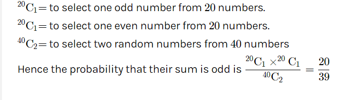

# Day 26 : Tasks

## Aptitude 

Out of 40 consecutive numbers two are chosen at random the probability that their sum is odd is ?

* 20/39
* 2/7
* 25/36
* 26/36


**Ans:20/39**

 ****To get the sum of 2 integers as odd one must be even and the other one must be odd.In 40 consecutive integers, 20 are even and 20 are odd.




## **Technical MCQ**

The disjoint set data structure plays a key role in which Algorithm to determine the minimum spanning tree of the graph? 

* Floyd Warshall's algorithm
* Kruskal's algorithm
* Dijkstra's algorithm
* None of these


**Ans:** Kruskal's Algorithm


## Coding Question

You are given two arrays \(without duplicates\) nums1 and nums2 where nums1’s elements are a subset of nums2. Find all the next greater numbers for nums1's elements in the corresponding places of nums2.

The Next Greater Number of a number x in nums1 is the first greater number to its right in nums2. If it does not exist, output -1 for this number.

**Example 1:**

 **`Input:`** 

```text
nums1 = [4,1,2]
nums2 = [1,3,4,2]
```

**`Output:`** 

```text
[-1,3,-1]
```

**`Explanation:`** For number 4 in the first array, you cannot find the next greater number for it in the second array, so output -1. For number 1 in the first array, the next greater number for it in the second array is 3. For number 2 in the first array, there is no next greater number for it in the second array, so output -1.

### **Solution:**

```cpp
vector<int> nextGreaterElement(vector<int>& nums1, vector<int>& nums2) 
    {
        //since there are no duplicates, we can store them in a map;
        
        vector<int> res(nums1.size(), -1); //to be returned, initialize it with -1.
        stack<int> st;
        unordered_map<int, int> umap;
        
        for(int i=0; i<nums2.size(); i++)
        {
            int element = nums2[i];
            
            while(!st.empty() && element > st.top())
            {
                //NGE of st.top() is element
				
                umap[st.top()] = element;
                st.pop();
            }
            
            st.push(element);
        }
        
        for(int i=0; i<nums1.size(); i++)
        {
            int ele = nums1[i];
            
            if(umap.find(ele) != umap.end())
            {
                int nge = umap[ele];
                res[i] = nge; //push NGE of desired element
            }
                
        }
        
        return res;
        
        
    }
```

\*\*\*\*

